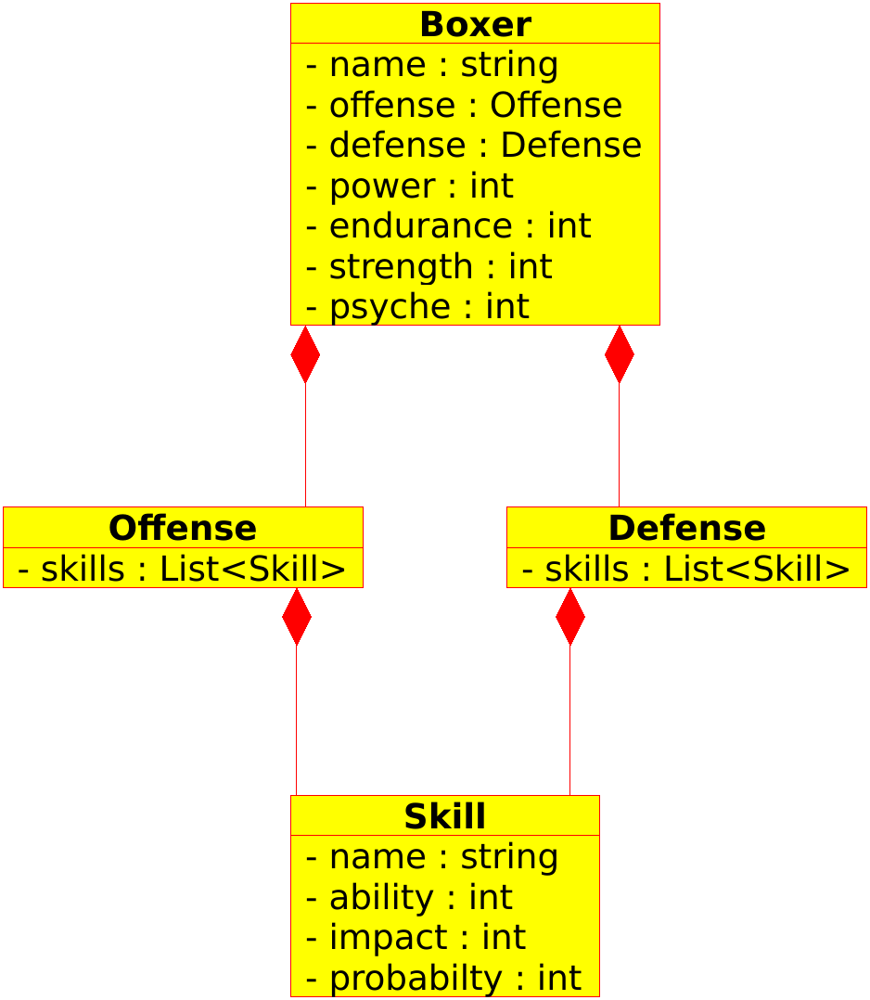

# Box-Manager
Simple boxing simulator, that simulates a fight, based on some (random) parameters.

## Boxer
- String name
- Offense offense
- Defense defense;
- double power = 10;
- double endurance;
- double strength;
- double motivation;
- ~~double speed~~;
- ~~double agility~~
- ~~double weight~~
- ~~double size~~
- ~~Tactics tactics~~
  - ~~offensive~~
  - ~~defensive~~

## Offense
- List<Skill> skills = new ArrayList<>();
  - jab
  - cross
  - hook
  
## Defense
- List<Skill> skills = new ArrayList<>();
  - block
  - parry
  - slip
  
## Skill
- String name;
- double ability;
- double impact;
- double probability;

# Class Diagram

